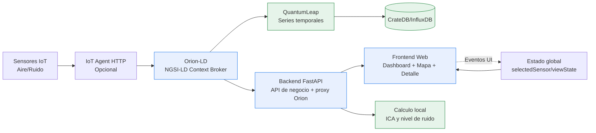
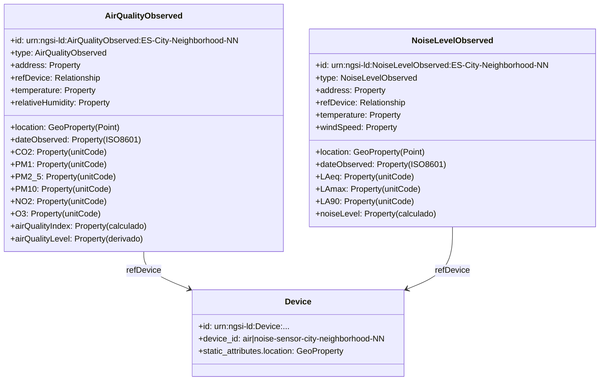

# APPLICATION.md

## 1. Objetivo de la aplicacion

La aplicacion implementa una plataforma completa de monitorizacion ambiental urbana (aire y ruido) basada en FIWARE y NGSI-LD para operar en tres niveles:

- Nivel de datos: integrar observaciones IoT heterogeneas en un modelo contextual interoperable.
- Nivel de negocio: exponer servicios API, calcular indicadores ambientales y mantener continuidad operativa con fallback.
- Nivel de consumo: ofrecer visualizacion geoespacial, lectura ejecutiva y detalle por sensor para ciudadania, administracion e investigacion.

Objetivos funcionales de producto:
- Monitorizar en tiempo casi real calidad del aire y contaminacion acustica.
- Traducir mediciones tecnicas a indicadores entendibles (ICA y nivel de ruido).
- Soportar analisis temporal cuando existe historico en QuantumLeap.
- Facilitar navegacion desde vision global (dashboard) hasta vision local (sensor).

## 2. Estado del arte del dominio de aplicacion

En smart cities, el estado del arte para monitorizacion ambiental combina gestion de contexto semantico, estandarizacion de datos y analitica temporal.

Patrones consolidados del dominio:
- Uso de context broker (Orion-LD) como fuente de verdad del estado actual.
- Modelado con Smart Data Models (AirQualityObserved y NoiseLevelObserved) para interoperabilidad.
- Persistencia historica desacoplada (QuantumLeap + motor de series temporales).
- Exposicion mediante API y capas de visualizacion geoespacial.

La aplicacion sigue estos patrones y los adapta al contexto docente/demo:
- Convencion URN NGSI-LD por tipo, ciudad y zona.
- Atributos geoespaciales GeoProperty y mediciones con unitCode.
- Capa backend que evita acoplamiento directo del frontend con Orion y simplifica CORS/cabeceras FIWARE.
- Estrategia pragmatica de resiliencia: si Orion o QuantumLeap no responden, se entrega informacion desde store local para mantener la experiencia.

Posicionamiento tecnico:
- No es solo una maqueta UI; integra cadena completa de ingesta-contexto-consumo.
- No pretende aun un despliegue productivo regulado; prioriza trazabilidad tecnica, comprension del dominio y base para escalar.

## 3. Funcionalidades principales

1. Plataforma FIWARE end-to-end
- Integracion con Orion-LD para entidades NGSI-LD.
- Soporte de flujo con IoT Agent (opcional en entorno local).
- Provisionado de entidades demo mediante endpoint de bootstrap.

2. API backend de negocio
- Endpoints REST para salud, sensores, panel global, detalle de aire y ruido.
- Proxy Orion para consultas NGSI-LD desde frontend sin problemas de CORS.
- Composicion de respuesta por ciudad para alimentar dashboard.

3. Logica ambiental
- Calculo de ICA a partir de PM2_5, PM10, NO2 y O3.
- Clasificacion del nivel de ruido a partir de LAeq.
- Enriquecimiento de entidades con indicadores derivados cuando faltan en origen.

4. Experiencia de usuario web
- Dashboard principal con estado agregado.
- Mapa principal y mapa geoespacial avanzado con filtros y clustering.
- Vista de detalle de sensor con metricas, historico semanal visual y recomendaciones.
- Soporte de internacionalizacion (es/en) y tema visual.

5. Persistencia y analitica temporal
- Consulta de historico en QuantumLeap cuando esta disponible.
- Fallback a series locales de ejemplo si no hay servicio temporal activo.

6. Operacion y despliegue local
- Stack levantable con Docker Compose para servicios FIWARE.
- Backend FastAPI y frontend estatico ejecutables de forma independiente.
- Scripts de simulacion de sensores para generar carga de prueba.

## 4. Funcionalidades detalladas (resumen de PRD.md)

Esta seccion resume la aplicacion completa, separando capacidades implementadas de capacidades previstas en PRD.

### 4.1 Capacidades implementadas en la version actual

1. Gestion de contexto y entidades
- Entidades principales: AirQualityObserved y NoiseLevelObserved.
- Soporte de multiples ciudades y zonas en IDs (ejemplo: ES-Madrid-Centro-01).
- Endpoints de consulta y bootstrap sobre API v1.

2. Consulta operativa en tiempo real
- Endpoint de dashboard con headline y resumen por ciudad.
- Endpoints de detalle por sensor para aire y ruido.
- Proxy a Orion-LD para listado de entidades y consulta de entidad puntual.

3. Visualizacion y navegacion de usuario
- Vista principal con KPIs de aire/ruido y ranking de ciudades.
- Vista avanzada full-screen con capas tematicas, filtros por umbral y clustering.
- Vista detalle de sensor accesible desde el mapa avanzado.

4. Analitica aplicada en cliente
- KPIs por dominio (aire o ruido) con lectura simplificada.
- Historico semanal visual en la vista detalle con Chart.js.
- Alertas OMS en frontend (safe, warning, danger).
- Recomendaciones de salud segun tipo de contaminante dominante.

5. Internacionalizacion y usabilidad
- Localizacion es/en para textos de shell, dashboard, mapa y detalle.
- Sincronizacion de estado entre vistas mediante eventos de frontend.

### 4.2 Capacidades contempladas en PRD (hoja de ruta)

1. Analitica avanzada y prediccion
- Prediccion de contaminacion a 72 horas.
- Deteccion de anomalias con modelos ML.

2. Asistente IA conversacional
- Interpretacion en lenguaje natural de metricas y tendencias.

3. Alertado multicanal productivo
- Notificaciones operativas (email/push) con reglas avanzadas.

4. Gobierno de datos para produccion
- Refuerzo de seguridad, control de acceso y hardening del proxy.
- Politicas de retencion historica e indicadores de SLO.

### 4.3 Capacidades transversales de la aplicacion completa

1. Datos y contratos
- Contrato NGSI-LD coherente entre backend, frontend y docs.
- Convenciones de unidad y timestamps para trazabilidad.

2. Resiliencia funcional
- Continuidad de servicio con fallback local ante indisponibilidad parcial.

3. Operacion reproducible
- Arranque local documentado para backend, frontend y FIWARE stack.
- Soporte de simuladores para validacion funcional de extremo a extremo.

## 5. Diagrama de arquitectura

Notas de lectura:
- Orion-LD es la fuente contextual principal.
- QuantumLeap/TSDB habilita historico (cuando esta desplegado).
- El backend desacopla el frontend del broker y aplica logica de negocio.

## 6. Diagrama del modelo de datos

Notas de modelado:
- Convencion de entidades: `urn:ngsi-ld:<Type>:ES-<City>-<Neighborhood>-<NN>`.
- Unidades frecuentes: `UG_M3`, `PPM`, `CEL`, `2N1`.
- El frontend deriva modelos temporales de UI (`weeklyHistory`, `whoAlert`, `healthRecommendations`) sin romper el contrato NGSI-LD.

---

Este documento describe la aplicacion completa en su estado actual y su alineacion con PRD.
